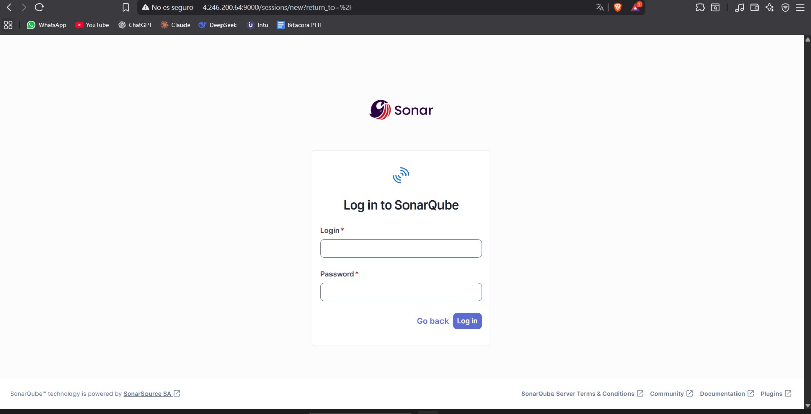
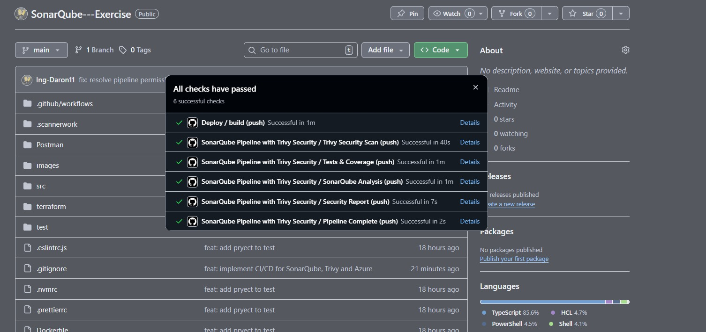

# Análisis Automatizado con SonarQube en Azure - Implementación CI/CD

## Resumen Ejecutivo

Este documento describe la implementación de un pipeline de Integración y Entrega Continua (CI/CD) para el proyecto AppNest Backend, integrando análisis de calidad de código mediante SonarQube desplegado en Microsoft Azure, y análisis de seguridad con Trivy. La solución automatiza el proceso de análisis estático de código en cada cambio del repositorio, garantizando estándares de calidad y seguridad consistentes.

## Objetivos del Proyecto

- Implementar infraestructura como código (IaC) utilizando Terraform para desplegar SonarQube en Azure
- Configurar pipeline automatizado de CI/CD con GitHub Actions
- Integrar análisis de seguridad mediante Trivy
- Automatizar análisis de calidad de código con cada commit
- Generar reportes consolidados de calidad y seguridad

## Arquitectura de la Solución

```
┌─────────────────────────────────────────────────────────────┐
│                    GitHub Repository                         │
│                  (SonarQube---Exercise)                      │
└────────────────────────┬────────────────────────────────────┘
                         │
                         │ Push Event / Pull Request
                         ▼
┌─────────────────────────────────────────────────────────────┐
│               GitHub Actions Pipeline                        │
│  ┌───────────────┐  ┌──────────────┐  ┌─────────────────┐  │
│  │ Trivy Scan    │  │ Tests &      │  │ SonarQube       │  │
│  │ (Security)    │  │ Coverage     │  │ Analysis        │  │
│  └───────────────┘  └──────────────┘  └─────────────────┘  │
└────────────────────────┬────────────────────────────────────┘
                         │
                         │ Analysis Results
                         ▼
┌─────────────────────────────────────────────────────────────┐
│                Azure Cloud Infrastructure                    │
│                     Region: East US                          │
│  ┌───────────────────────────────────────────────────────┐  │
│  │  Resource Group: rg-sonarqube-appnest                 │  │
│  │                                                        │  │
│  │  ┌──────────────────────────────────────────────┐    │  │
│  │  │ Virtual Machine: vm-sonarqube                │    │  │
│  │  │ - OS: Ubuntu 22.04 LTS                       │    │  │
│  │  │ - Size: Standard_D2s_v3 (2 vCPU, 8 GB RAM)  │    │  │
│  │  │ - Public IP: 4.246.200.64                    │    │  │
│  │  │                                               │    │  │
│  │  │  ┌────────────────────────────────────────┐  │    │  │
│  │  │  │ Docker Containers                      │  │    │  │
│  │  │  │  ┌──────────────┐  ┌───────────────┐  │  │    │  │
│  │  │  │  │ SonarQube    │  │ PostgreSQL    │  │  │    │  │
│  │  │  │  │ Community    │  │ Database      │  │  │    │  │
│  │  │  │  │ Port: 9000   │  │ Port: 5432    │  │  │    │  │
│  │  │  │  └──────────────┘  └───────────────┘  │  │    │  │
│  │  │  └────────────────────────────────────────┘  │    │  │
│  │  └──────────────────────────────────────────────┘    │  │
│  │                                                        │  │
│  │  Network Configuration:                               │  │
│  │  - Virtual Network: vnet-sonarqube (10.0.0.0/16)     │  │
│  │  - Subnet: subnet-sonarqube (10.0.2.0/24)            │  │
│  │  - NSG: Ports 22, 80, 443, 9000                      │  │
│  └───────────────────────────────────────────────────────┘  │
└─────────────────────────────────────────────────────────────┘
```

## Implementación de la Infraestructura

### 1. Configuración de Terraform

Se desarrolló una configuración de Terraform para automatizar el despliegue de la infraestructura en Azure. Los componentes principales incluyen:

**Estructura de archivos:**
```
terraform/
├── main.tf           # Definición de recursos de Azure
├── variables.tf      # Variables de configuración
├── outputs.tf        # Outputs de información de despliegue
└── scripts/
    └── init.sh       # Script de inicialización de la VM
```

**Recursos creados:**
- Resource Group: `rg-sonarqube-appnest`
- Virtual Network: `vnet-sonarqube` (10.0.0.0/16)
- Subnet: `subnet-sonarqube` (10.0.2.0/24)
- Public IP: `pip-sonarqube` (4.246.200.64)
- Network Security Group con reglas para puertos 22, 80, 443, 9000
- Network Interface: `nic-sonarqube`
- Virtual Machine: `vm-sonarqube` (Ubuntu 22.04 LTS, Standard_D2s_v3)

### 2. Despliegue de la Infraestructura

El despliegue se realizó mediante los siguientes comandos:

```bash
# Autenticación en Azure
az login

# Inicialización de Terraform
cd terraform
terraform init

# Revisión del plan de despliegue
terraform plan

# Aplicación de la infraestructura
terraform apply -auto-approve
```

**Resultado del despliegue:**

La infraestructura se desplegó exitosamente en la región East US de Azure. La máquina virtual quedó operativa con la siguiente información de acceso:

- **IP Pública:** 4.246.200.64
- **URL SonarQube:** http://4.246.200.64:9000
- **Usuario SSH:** azureuser
- **VM Name:** vm-sonarqube


*Figura 1: Máquina virtual desplegada en el portal de Azure*

### 3. Configuración Automatizada de la VM

El script `init.sh` se ejecutó automáticamente durante el aprovisionamiento de la VM, realizando las siguientes tareas:

1. Actualización del sistema operativo
2. Instalación de Docker y Docker Compose
3. Configuración de límites del sistema para SonarQube
4. Despliegue de contenedores mediante Docker Compose:
   - SonarQube Community Edition
   - PostgreSQL 13 (base de datos)
5. Configuración de servicios systemd para auto-restart
6. Instalación de Node.js 20 y SonarScanner CLI
7. Configuración de firewall (UFW)

## Configuración de SonarQube

### 1. Acceso Inicial y Configuración de Seguridad

Una vez desplegada la infraestructura, se accedió a SonarQube mediante la URL http://4.246.200.64:9000 y se completó la configuración inicial:

1. Login con credenciales por defecto (admin/admin)
2. Cambio de contraseña administrativa
3. Configuración de perfil de administrador


*Figura 2: Instancia de SonarQube operativa en Azure*

### 2. Creación del Proyecto

Se creó el proyecto "AppNest Backend - NestJS API" con las siguientes características:

- **Project Key:** AppNest-backend
- **Main Branch:** main
- **Analysis Method:** GitHub Actions


*Figura 3: Configuración inicial del proyecto en SonarQube*

### 3. Generación de Token de Autenticación

Se generó un token de acceso para la integración con GitHub Actions:
- **Token Type:** Project Analysis Token
- **Token Name:** AppNest-backend-token
- **Scope:** Analyze "AppNest-backend"

## Implementación del Pipeline CI/CD

### 1. Configuración de GitHub Secrets

Se configuraron los siguientes secrets en el repositorio de GitHub para la integración segura:

- `SONAR_HOST_URL`: http://4.246.200.64:9000
- `SONAR_TOKEN`: Token de autenticación del proyecto

### 2. Estructura del Workflow

Se implementó un workflow de GitHub Actions (`.github/workflows/sonarqube-pipeline.yml`) con los siguientes jobs:

#### Job 1: Trivy Security Scan
- Escaneo de vulnerabilidades en el sistema de archivos del proyecto
- Generación de reportes en formato SARIF
- Subida de resultados a GitHub Security tab
- Generación de reportes en formato JSON para análisis detallado

#### Job 2: Tests & Coverage
- Configuración de servicio PostgreSQL para pruebas
- Instalación de dependencias mediante Yarn
- Ejecución de pruebas unitarias con cobertura
- Ejecución de pruebas E2E (users y equipment)
- Generación de reportes de cobertura en formato LCOV
- Subida de artefactos de cobertura

#### Job 3: SonarQube Analysis
- Descarga de artefactos de cobertura
- Ejecución de pruebas con cobertura
- Instalación de SonarScanner
- Análisis estático de código con los siguientes parámetros:
  - Project Key: AppNest-backend
  - Source Directory: src/
  - Test Directory: test/
  - Coverage Report: coverage/lcov.info
  - Exclusiones: archivos de test, node_modules, dist

#### Job 4: Security Report
- Consolidación de resultados de Trivy
- Generación de reporte de seguridad unificado
- Almacenamiento de artefactos para revisión

#### Job 5: Pipeline Complete
- Notificación de finalización exitosa
- Información de acceso a reportes

### 3. Archivo de Configuración SonarQube

Se creó el archivo `sonar-project.properties` con la siguiente configuración:

```properties
sonar.projectKey=AppNest-backend
sonar.projectName=AppNest Backend - NestJS API
sonar.projectVersion=1.0.0

# Rutas de código fuente y tests
sonar.sources=src
sonar.tests=test
sonar.exclusions=node_modules/**,dist/**,coverage/**

# Configuración TypeScript/JavaScript
sonar.javascript.lcov.reportPaths=coverage/lcov.info
sonar.typescript.tsconfigPath=tsconfig.json

# Exclusiones de cobertura
sonar.coverage.exclusions=**/*.spec.ts,**/*.e2e-spec.ts,**/node_modules/**,**/dist/**
```

## Resultados del Análisis

### 1. Ejecución del Pipeline

El pipeline se ejecuta automáticamente con cada push al repositorio. Los resultados de una ejecución exitosa muestran:


*Figura 4: Ejecución exitosa de todos los jobs del pipeline CI/CD*

**Resumen de ejecución:**
- ✅ Trivy Security Scan: Completado (40s)
- ✅ Tests & Coverage: Completado (1m)
- ✅ SonarQube Analysis: Completado (1m)
- ✅ Security Report: Completado (7s)
- ✅ Pipeline Complete: Completado (2s)

### 2. Análisis de Calidad de Código (SonarQube)


*Figura 5: Dashboard de análisis de calidad en SonarQube*

**Métricas obtenidas:**
- **Quality Gate:** Passed ✅
- **Security Issues:** 0 (A rating)
- **Reliability Issues:** 17 (C rating)
- **Maintainability Issues:** 53 (A rating)
- **Coverage:** 74.2%
- **Duplications:** 0.0%
- **Hotspots Reviewed:** 0.0% (E rating)
- **Lines of Code:** 2,700

**Análisis de resultados:**
- El proyecto cumple con el Quality Gate establecido
- No se encontraron vulnerabilidades de seguridad
- La cobertura de pruebas alcanza el 74.2%, superando el mínimo recomendado
- No se detectó código duplicado
- Se identificaron 17 issues de confiabilidad que requieren atención
- Se identificaron 53 code smells relacionados con mantenibilidad

### 3. Análisis de Seguridad (Trivy)


*Figura 6: Reporte de vulnerabilidades detectadas por Trivy en GitHub Security*

**Resumen de vulnerabilidades detectadas:**
- **Total de alertas:** 46
- **Critical:** 2
  - sha.js: Missing type checks leading to hash rewind and passing on crafted data
- **High:** Múltiples vulnerabilidades
  - multer: Denial of Service vulnerabilities
  - multer: Memory leak issues
  - multer: Unhandled exception vulnerabilities

**Integración con GitHub Security:**
- Las vulnerabilidades se reportan automáticamente en la pestaña Security del repositorio
- Cada vulnerabilidad incluye:
  - Severidad (Critical, High, Medium, Low)
  - Archivo afectado (yarn.lock, package-lock.json)
  - Descripción detallada
  - Recomendaciones de mitigación

## Configuración de Permisos

El workflow requiere los siguientes permisos de GitHub Actions:

```yaml
permissions:
  contents: read
  security-events: write
  actions: read
```

Estos permisos permiten:
- Lectura del contenido del repositorio
- Escritura de eventos de seguridad para Trivy
- Lectura de metadatos de Actions

## Gestión de la Infraestructura

### Comandos de Terraform

```bash
# Ver estado actual de la infraestructura
terraform show

# Ver outputs de configuración
terraform output

# Destruir infraestructura (cuando sea necesario)
terraform destroy

# Validar configuración
terraform validate

# Formatear archivos
terraform fmt
```

### Comandos de Azure CLI

```bash
# Listar recursos del grupo
az resource list --resource-group rg-sonarqube-appnest

# Verificar IP pública
az network public-ip show \
  --resource-group rg-sonarqube-appnest \
  --name pip-sonarqube \
  --query ipAddress

# Conectar por SSH a la VM
ssh azureuser@4.246.200.64
```

### Gestión de SonarQube en la VM

```bash
# Verificar estado de contenedores
sudo docker ps

# Ver logs de SonarQube
sudo docker logs sonarqube

# Reiniciar servicios
cd /opt/sonarqube
sudo docker-compose restart

# Ver logs de inicialización
cat /var/log/sonarqube-init.log
```

## Mejores Prácticas Implementadas

1. **Infraestructura como Código (IaC):**
   - Configuración versionada con Terraform
   - Despliegue reproducible y automatizado
   - Documentación implícita en código

2. **Seguridad:**
   - Análisis automatizado de vulnerabilidades con Trivy
   - Tokens de acceso almacenados en GitHub Secrets
   - Network Security Groups con reglas restrictivas
   - Firewall configurado en la VM

3. **Calidad de Código:**
   - Quality Gates automatizados
   - Análisis en cada commit
   - Métricas de cobertura de pruebas
   - Detección de code smells

4. **CI/CD:**
   - Pipeline automatizado
   - Ejecución paralela de jobs
   - Generación de artefactos
   - Notificaciones de estado

5. **Monitoreo:**
   - Reportes consolidados en GitHub
   - Dashboard de SonarQube en tiempo real
   - Alertas de seguridad integradas

## Conclusiones

Se implementó exitosamente un pipeline de CI/CD completo que integra análisis de calidad de código y seguridad para el proyecto AppNest Backend. La solución cumple con los siguientes logros:

1. **Infraestructura Automatizada:** Despliegue completo de SonarQube en Azure mediante Terraform
2. **Análisis Continuo:** Evaluación automática de calidad y seguridad en cada cambio
3. **Visibilidad:** Reportes integrados en GitHub y SonarQube
4. **Escalabilidad:** Arquitectura basada en contenedores fácilmente escalable
5. **Mantenibilidad:** Código de infraestructura versionado y documentado

**Resultados cuantificables:**
- Quality Gate: Passed ✅
- Coverage: 74.2%
- 0 vulnerabilidades de seguridad en código
- 46 vulnerabilidades detectadas en dependencias
- Tiempo de análisis: ~2 minutos por ejecución

**Recursos desplegados:**
- 1 Resource Group en Azure
- 1 Virtual Machine (Standard_D2s_v3)
- 1 IP Pública estática
- 1 Virtual Network con subnet dedicada
- 1 Network Security Group
- 2 contenedores Docker (SonarQube + PostgreSQL)

La implementación proporciona una base sólida para mantener altos estándares de calidad y seguridad en el desarrollo continuo del proyecto.