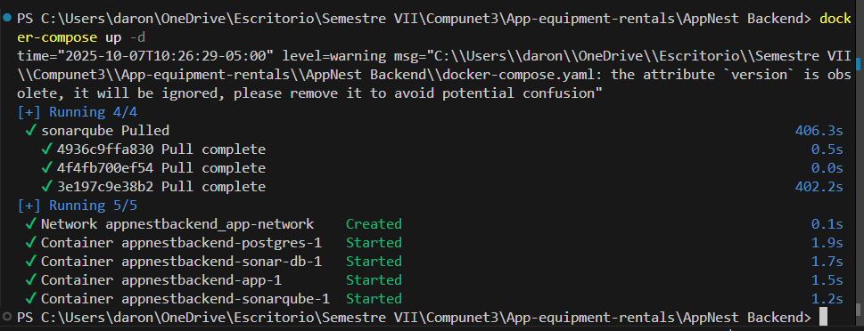
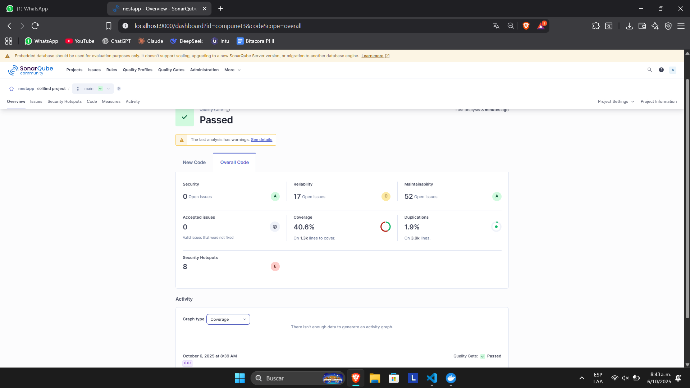

# Proceso de Análisis Local con SonarQube

Este documento describe los pasos realizados para configurar y ejecutar un análisis de calidad de código localmente utilizando SonarQube sobre el proyecto [AppNest](https://github.com/Ing-Daron11/AppNest.git).

## 1. Configuración del Entorno Docker

Para orquestar los servicios necesarios (la aplicación, la base de datos y SonarQube), se utilizó Docker.

### Dockerfile

Se creó un `Dockerfile` en la raíz del proyecto `AppNest` para contenedorizar la aplicación:

```dockerfile
FROM node:20-alpine

WORKDIR /app

COPY package*.json ./
COPY yarn.lock ./

RUN yarn install

COPY . .

RUN yarn build

EXPOSE 3000

CMD ["yarn", "start:prod"]
```

### Docker Compose

Se configuró un archivo `docker-compose.yaml` para definir y ejecutar los servicios de la aplicación, la base de datos de la aplicación, SonarQube y su base de datos.

```yaml
  sonarqube:
    image: sonarqube:community
    ports:
      - "9000:9000"
    networks:
      - app-network
    environment:
      - SONARQUBE_JDBC_URL=jdbc:postgresql://sonar-db:5432/sonar
      - SONARQUBE_JDBC_USERNAME=sonar
      - SONARQUBE_JDBC_PASSWORD=sonar
    volumes:
      - sonarqube_conf:/opt/sonarqube/conf
      - sonarqube_data:/opt/sonarqube/data
      - sonarqube_extensions:/opt/sonarqube/extensions
      - sonarqube_bundled-plugins:/opt/sonarqube/lib/bundled-plugins
    depends_on:
      - sonar-db

  sonar-db:
    image: postgres:14
    networks:
      - app-network
    environment:
      - POSTGRES_USER=sonar
      - POSTGRES_PASSWORD=sonar
      - POSTGRES_DB=sonar
    volumes:
      - postgresql:/var/lib/postgresql
      - postgresql_data:/var/lib/postgresql/data

volumes:
  postgres_data:
  sonarqube_conf:
  sonarqube_data:
  sonarqube_extensions:
  sonarqube_bundled-plugins:
  postgresql:
  postgresql_data:

networks:
  app-network:
    driver: bridge
```

## 2. Instalación y Configuración del Scanner

Se instaló globalmente el SonarScanner CLI y se agregó su directorio `/bin` al PATH del sistema para poder invocarlo desde cualquier ubicación.

## 3. Ejecución y Análisis

1.  Se levantaron todos los servicios definidos en el `docker-compose.yaml` con el comando:
    ```bash
    docker-compose up -d
    ```
    

2.  Se accedió a la interfaz web de SonarQube en `http://localhost:9000`.


3.  Dentro de SonarQube, se creó un nuevo proyecto de forma manual ("Locally") y se seleccionó "JS/TS/web" como el lenguaje principal.
4.  SonarQube proporcionó los comandos necesarios para ejecutar el análisis. Primero, se instaló el scanner de Sonar para Node.js:
    ```bash
    npm install -g @sonar/scan
    ```
5.  Finalmente, se ejecutó el scanner desde la raíz del proyecto `AppNest` con el token y la clave del proyecto proporcionados por SonarQube:
    ```bash
    sonar-scanner -Dsonar.host.url=http://localhost:9000 -Dsonar.token=sqp_xxxxxxxxxxxxxxxxxxxxxxxxxxxxxxxxxxxxxxxx -Dsonar.projectKey=compunet3
    ```

Con estos pasos, el reporte de análisis de código se generó y se pudo visualizar en la interfaz de SonarQube.


